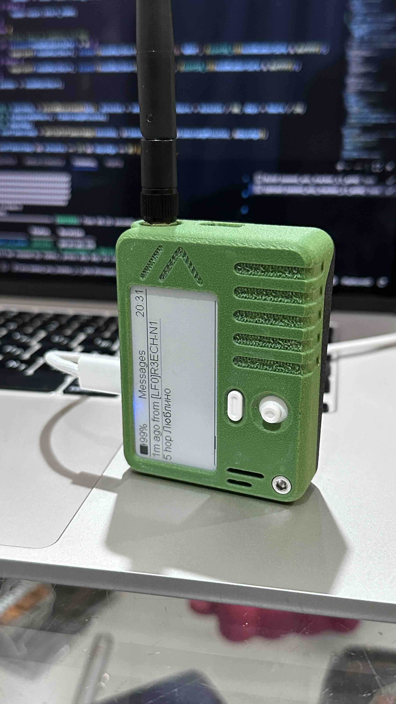

# Meshtastic

## Полезные кастомные прошивки для устройств Meshtastic

### Seeed Wio Tracker L1 E-ink

Собрал модифицированную прошивку для [корпуса](https://www.printables.com/model/1420534-seeed-wio-tracker-l1-e-ink-enclosure) из printables.com,
расположение дисплея в котором отличается от стандартной версии Wio Tracker L1.  

Данная версия прошивки:

- Переворачивает кнопки джойстика на 90 градусов
- Добавляет возможность читать сообщения на русском языке

Прошивка:
[seeed_wio_tracker_L1_eink_v2.7.13_RU_fixed_joy.uf2](https://github.com/Nastradamus/Meshtastic/blob/5444707b44fb66e9464707df867f7d56311aecbb/seeed_wio_tracker_L1_eink_v2.7.13_RU_fixed_joy.uf2)

---
